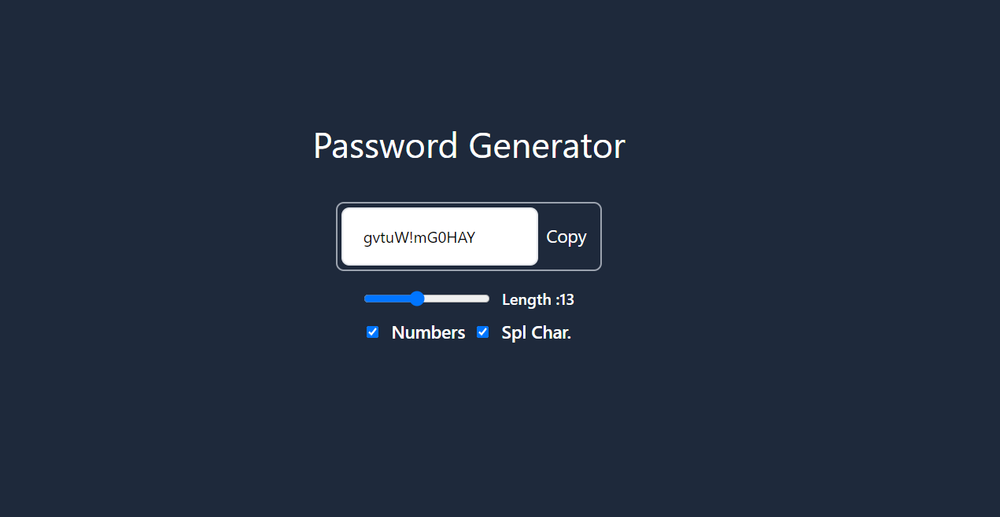

# React
 <h2> 1.Testimonial</h2>  
 <ul>
    <li>Using useState I'm changing between the cards by calling a function </li>  
    <li> The testimonials are stored in an array of objects (data.js), each object represents a card with its own name, photo, description and designation. </li> 
  </ul>
 <h5> Screenshot </h5> 

    

 <h2> 2. Password Generator</h2> 
 <li>This is a simple password generator that generates random alphanumeric characters and special symbols.</li> 
 <li>The generated password length can be set by the user between 1 to 30 and default value will be 8 </li>  
 <li>And it will generate a new password every time when user cicks on length/ numers/ special character </li> 

<h5>Screenshot</h5> 

  